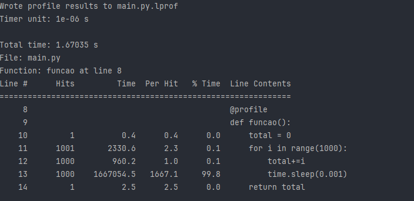

# Description

This repository contains an example of how to use Python's line_profiler lib to optimize the Python code.

# Steps to run locally

## Step 1

Install the line_profiler lib by running the following command:

```bash
$ pip install line_profiler
```

## Step 2
 
Run the following command to analyze the code:

```bash
$ kernprof -lv main.py
```

## Result
 
Detailed information about the necessary time to run each line of the code, as we can see in the image below:

